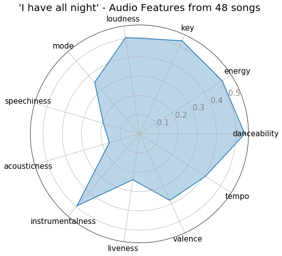
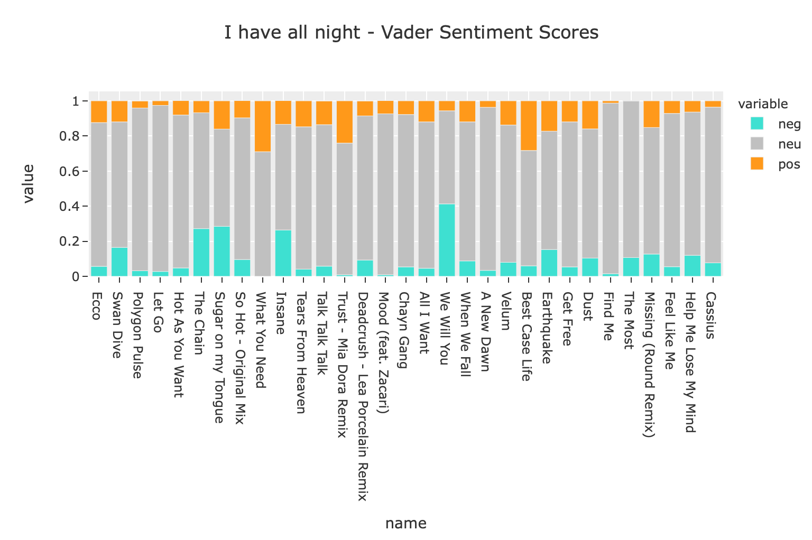

# Exploring & visualizing a playlist using Spotify and Genius APIs.

Follow my [blog](https://annadangela.medium.com/playlist-analysis-using-genius-api-d7dedaaf4b9?sk=e39b6f903590d799852a8f2f7cdf4a8f).

In this repo, we will explore how to use the Spotify API to gather playlist data. Then we will analyze the songs in the playlist for music feature scores and plot as a radar graph.

We will then use the Genius API to gather lyric data for the songs and run a quick sentiment analysis of the playlist using VADER.
